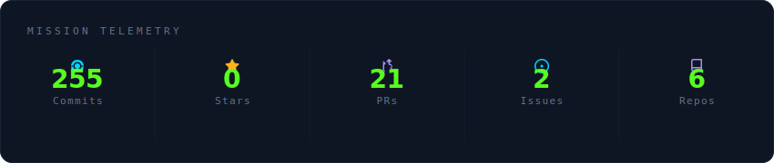

<!-- Galaxy Profile README Template
     Customize this file with your own info, then rename it to README.md
     in your GitHub profile repo (github.com/YOUR_USERNAME/YOUR_USERNAME).
     The SVG paths below point to assets/generated/ which are auto-generated
     by the GitHub Actions workflow or by running: python -m generator.main -->

  

 

  

 

  

 

  

 

<strong>Mais sobre: </strong>

 

Analista de Sistemas no Hospital Regional de Rio Maria .
Desenvolvedor Full-Stack, entusiasta por Tecnologia, Musica, Games e Esportes.
Cristão

**Currently at** Hospital Regional de Rio Maria — Rio Maria, PA

 

  
  

