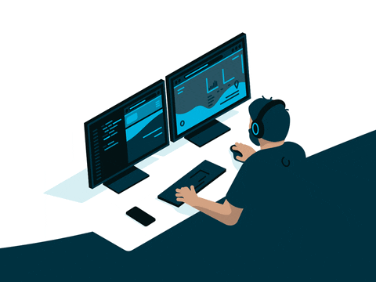

# Olá 👋, Eu sou Marcus Vinícius

- Full Stack Developer | Aluno Explorer na Rocketseat
- Graduado em Análise e Desenvolvimento de Sistemas
  
 ## 🚀 Minhas Skills
 
  
  
  
  
  

## 📨 Contato
 

  

 

